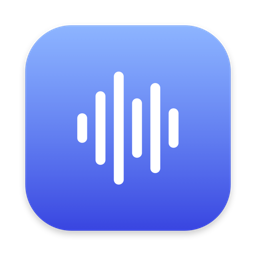
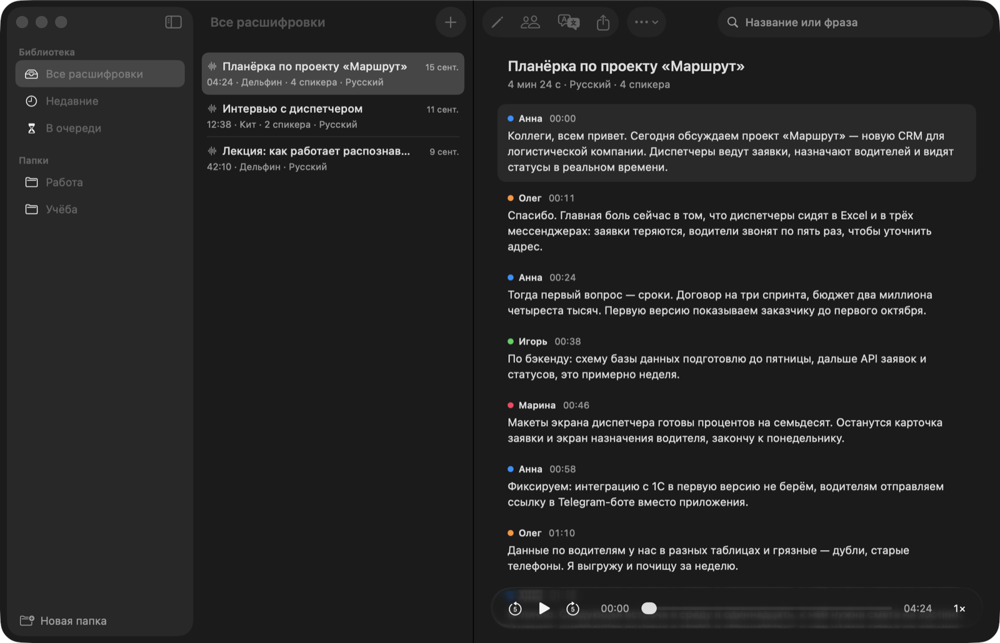
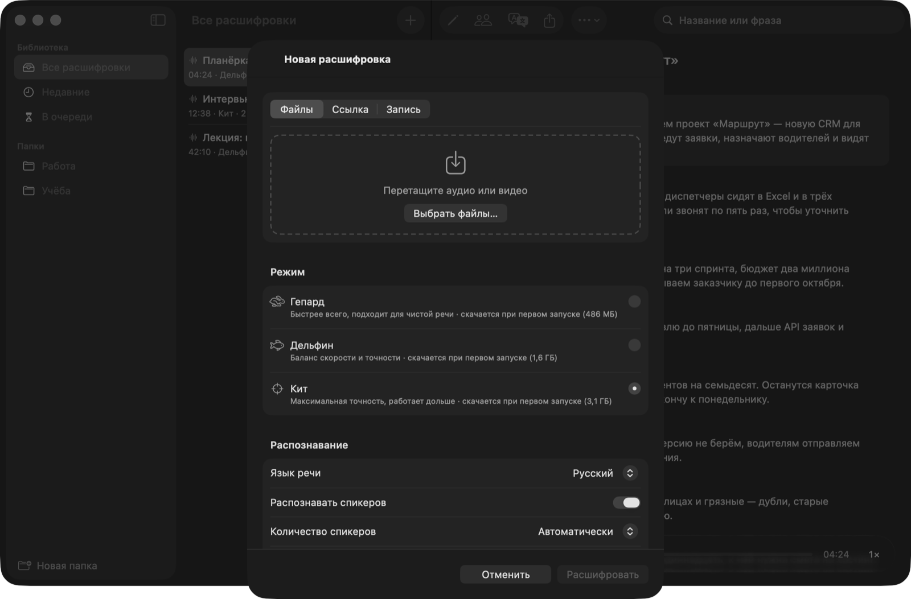
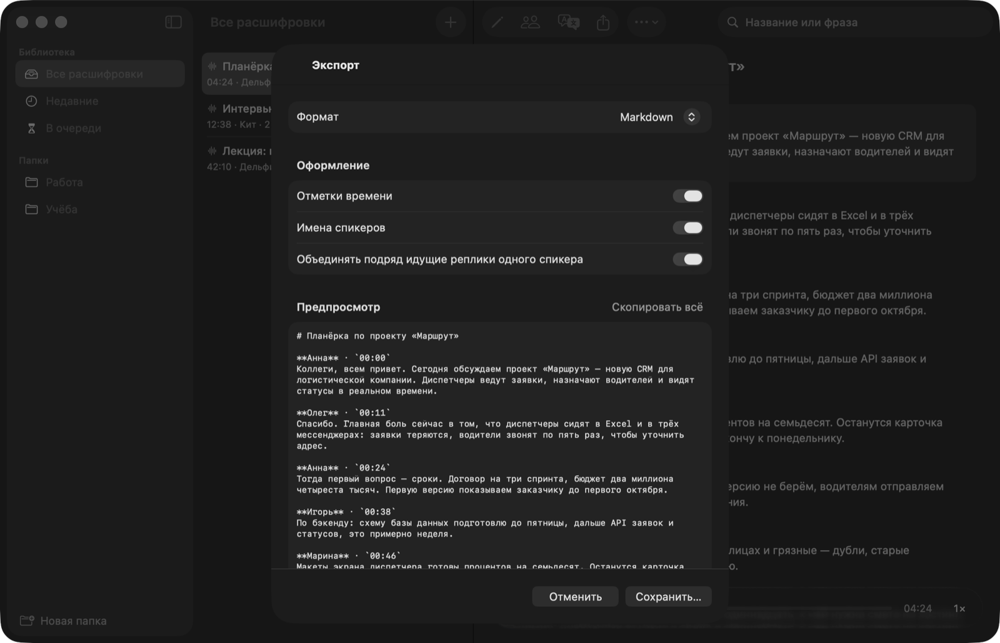
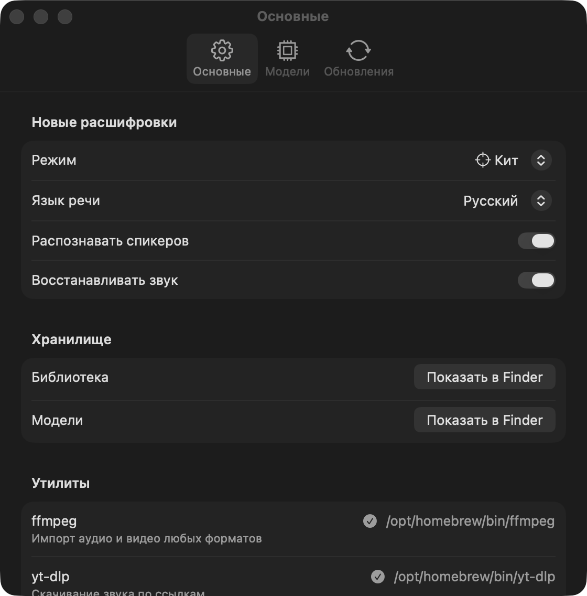

<div align="center">



# Steno

**Расшифровка встреч, интервью и лекций прямо на Mac. Файлы никуда не уходят.**

[](https://github.com/Arti-Ko/steno/releases/latest)


[**⬇ Скачать Steno.dmg**](https://github.com/Arti-Ko/steno/releases/latest/download/Steno.dmg) · [Все выпуски](https://github.com/Arti-Ko/steno/releases)



</div>

## Как это работает

1. Перетащите аудио или видео, вставьте ссылку или запишите с микрофона.
2. Whisper распознаёт речь, pyannote размечает спикеров — всё на вашем Mac, без интернета.
3. Текст синхронизирован с записью: щелчок по реплике перематывает звук, а активная реплика подсвечивается.

## Что умеет

### Импорт и режимы распознавания



- **Файлы** — перетаскиванием или пачкой; подойдёт всё, что читает ffmpeg.
- **Ссылки** — YouTube, Dropbox, Google Drive и прямые ссылки через yt-dlp: скачивается только звук.
- **Запись с микрофона** — прямо в окне импорта.
- **Три режима:** Гепард (быстрее всего), Дельфин (баланс) и Кит (максимальная точность). Модель скачивается один раз.
- **99 языков** с автоопределением и **распознавание спикеров** — автоматически или заданным числом.
- **Восстановление звука** — шумоподавление и выравнивание громкости для тихих и шумных записей.

### Работа с текстом

- Правка реплик на месте, переименование записи в списке и в заголовке.
- Имена спикеров: переименование, объединение, переназначение отдельных реплик.
- Поиск по расшифровке (⌘F) и по всей библиотеке — по названиям и по тексту.
- Перевод расшифровки системным переводчиком Apple, тоже на устройстве.
- Видео для mp4 и mov показывается прямо над текстом.

### Экспорт



DOCX, PDF, TXT, Markdown, CSV, JSON и субтитры SRT и VTT — с настройкой длины строк и длительности титров. Можно выгрузить сразу несколько расшифровок.

### Библиотека и очередь

Папки, поиск, очередь с прогрессом по этапам, бейдж в Dock и уведомление, когда расшифровка готова.

### Настройки



Значения по умолчанию для новых расшифровок, папки с данными и моделями, проверка ffmpeg и yt-dlp, управление скачанными моделями и обновлениями.

## Установка

1. Скачайте [Steno.dmg](https://github.com/Arti-Ko/steno/releases/latest/download/Steno.dmg), откройте и перетащите Steno в «Программы».
2. Приложение не заверено у Apple, поэтому при первом запуске macOS его остановит: **Системные настройки → Конфиденциальность и безопасность → «Всё равно открыть»**. Или в Терминале: `xattr -dr com.apple.quarantine /Applications/Steno.app`.
3. Установите ffmpeg: `brew install ffmpeg`. Для ссылок понадобится ещё `brew install yt-dlp`.

Нужны macOS 26 и Mac на Apple Silicon.

## Обновления

Steno сам проверяет выпуски при запуске и каждые 6 часов. Новая версия скачивается в фоне и ставится, когда вы закрываете приложение, — работа не прерывается. Чтобы обновиться сразу, нажмите «Перезапустить для версии X» внизу боковой панели. Автоматическую установку можно выключить в **Настройках → Обновления**.

## Данные и приватность

Записи, расшифровки и модели лежат в `~/Library/Application Support/Steno/`. Ни звук, ни текст никуда не отправляются: распознавание, спикеры и перевод работают на вашем Mac. В интернет Steno ходит только за моделями, за обновлениями и за файлами по ссылкам, которые вы сами добавили.

## Разработка

```sh
xcodebuild -downloadComponent MetalToolchain   # один раз, если понадобится сборка шейдеров
Scripts/build.sh              # dist/Steno.app
Scripts/build.sh --install    # сразу в /Applications
Scripts/package.sh            # dist/Steno.dmg и dist/Steno.zip
swift test                    # юнит-тесты
```

Полный прогон движка на своём файле:

```sh
STENO_AUDIO=~/audio.m4a STENO_MODE=cheetah swift test --filter EngineIntegration
```

`STENO_LIBRARY_ROOT=/путь` запускает приложение с отдельной библиотекой — удобно для демонстраций и снимков экрана.

На машине, где в глобальном git стоит `safe.bareRepository=explicit`, SwiftPM ломается. Перед командами `swift`:

```sh
export GIT_CONFIG_COUNT=1 GIT_CONFIG_KEY_0=safe.bareRepository GIT_CONFIG_VALUE_0=all
```

## Выпуск версии

```sh
Scripts/release.sh 1.2.0
```

Скрипт обновляет `VERSION`, ставит тег и отправляет его на GitHub. Дальше GitHub Actions на `macos-26` прогоняет тесты, собирает `Steno.dmg` и `Steno.zip` и публикует выпуск — установленные копии увидят его при следующей проверке.

## Под капотом

Swift и SwiftUI на системных элементах macOS 26 · [WhisperKit](https://github.com/argmaxinc/argmax-oss-swift) для распознавания · SpeakerKit (pyannote) для спикеров · ffmpeg и yt-dlp для импорта · Apple Translation для перевода.
